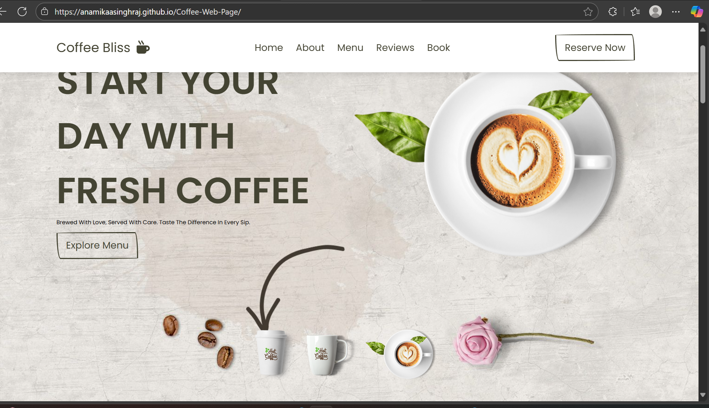

# Coffee-Web-Page

**Coffee Bliss – A simple coffee-themed webpage built using HTML, CSS, and JavaScript.**

This project is a beginner-friendly static website that showcases a coffee shop landing page.  
It demonstrates responsive design, navigation toggle, image slider, and smooth animations.

---

## 🚀 Features
- Responsive navigation menu (hamburger toggle on small screens)
- Image slider with interactive previews
- Swiper.js review slider with autoplay
- Smooth scroll effects
- Simple, clean UI theme (Coffee Bliss ☕✨)

---

## 🖼️ Screenshot

---

## 🛠️ Tech Stack
- **HTML5**
- **CSS3**
- **JavaScript (Vanilla)**
- **Swiper.js** (for review slider)

